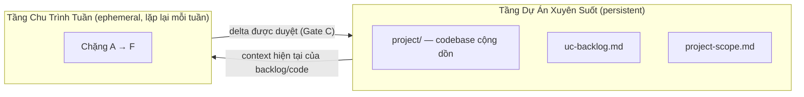
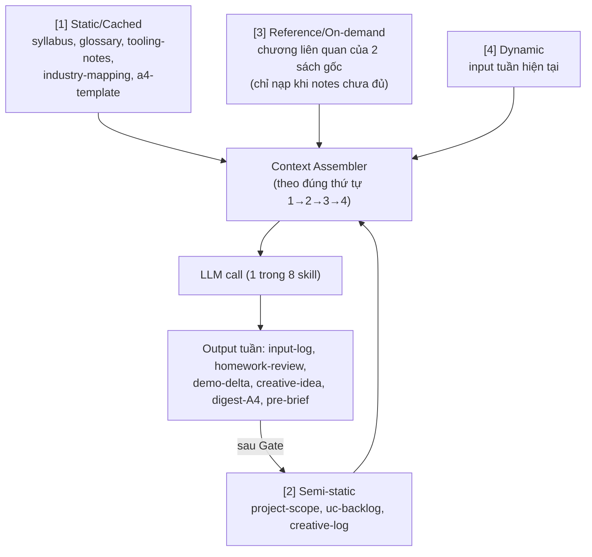

# Kiến Trúc Hệ Thống — SOA Weekly Summary Model

---

## 1. Kiến trúc 2 tầng



Nguyên tắc: tầng `Ephemeral` **chỉ được đề xuất** thay đổi vào tầng `Persistent`; mọi ghi thực sự vào `uc-backlog.md` hoặc `project/` phải đi qua Gate (con người duyệt), không có đường ghi trực tiếp nào từ skill vào tầng persistent.

---

## 2. Kiến trúc tri thức của LLM trong project (Knowledge Architecture)

### 2.1 Phân loại nguồn tri thức

| Loại | File | Tần suất thay đổi | Vai trò |
|---|---|---|---|
| **Static / Cached** | `syllabus.md`, `glossary-soa.md`, `tooling-notes.md`, `industry-mapping.md`, `a4-digest-template.md` | Gần như không đổi trong suốt 13 tuần | Nền tảng quy chuẩn của khóa học, dùng để đối chiếu (Chặng A) và tổng hợp (Chặng D) |
| **Reference / On-demand** | `books/api-design-patterns.pdf` (JJ Geewax), `books/building-an-api-product.pdf` (Bruno Pedro) — **do bạn tự thêm vào, không đi kèm sẵn trong repo vì lý do bản quyền** — cùng 2 file tóm tắt sẵn có `api-design-patterns-notes.md`, `building-api-product-notes.md` | Không đổi, nhưng **chỉ đọc đúng chương liên quan tuần đó** | Tra cứu định nghĩa gốc khi `input-conflict-audit` cần đối chiếu sâu hơn bản tóm tắt; **không nạp toàn bộ sách vào mọi lần gọi** |
| **Semi-static** | `project-scope.md`, `uc-backlog.md`, `creative-log.md` | Đổi 1 lần/tuần (sau Gate C/D) | Trạng thái hiện tại của dự án xuyên suốt + lịch sử ý tưởng sáng tạo đã đề xuất (để `creative-llm-experiment` không đề xuất trùng) |
| **Dynamic / per-week** | `weeks/week-XX/input-log.md`, `homework-review.md`, `demo-delta.diff`, `creative-idea.md`, `digest-A4.md`, `pre-brief.md` | Tạo mới mỗi tuần | Input/output của riêng tuần đó, không tái sử dụng. `pre-brief.md` là input mồi cho tuần kế tiếp nhưng vẫn thuộc Dynamic vì gắn với 1 tuần cụ thể |

> **Lý do tách "Reference / On-demand" ra khỏi "Static / Cached"**: hai cuốn sách gốc có dung lượng lớn nhưng mỗi tuần chỉ liên quan 1–2 chương. Nếu nạp toàn bộ sách vào khối luôn-cache, phần lớn token bị lãng phí cho nội dung không liên quan tuần hiện tại. Thay vào đó, `input-conflict-audit` chỉ đọc đúng chương được nhắc ở mục "Tài liệu đọc trước" của tuần đó, và chỉ khi bản tóm tắt (`*-notes.md`) không đủ chi tiết để đối chiếu.
>
> **Lưu ý bản quyền**: file PDF gốc của 2 cuốn sách là tài liệu thương mại — repo/project **không tự tải hoặc phân phối** các file này; bạn cần tự thêm bản mình đã mua hợp pháp vào `books/` (thư mục này nên nằm trong `.gitignore` nếu repo có chia sẻ công khai). Khi LLM trích dẫn nội dung từ 2 cuốn sách trong `input-conflict-audit` hoặc `homework-critique`, chỉ diễn giải/paraphrase — không chép nguyên văn đoạn dài.

### 2.2 Chiến lược caching (prompt/context caching)

Vì nhóm **Static** chiếm phần lớn dung lượng context nhưng gần như không đổi qua các lần gọi LLM trong suốt khóa học, nên áp dụng **context caching** (cơ chế cache theo prefix của Claude API) để giảm token cost và latency:

**Nguyên tắc sắp xếp context theo thứ tự cố định — bất biến giữa các lần gọi:**

```
[1] Static / Cached block     (syllabus + glossary + tooling-notes + industry-mapping + a4-template)
    └─ ĐẶT CỐ ĐỊNH Ở ĐẦU, không đổi thứ tự, không đổi nội dung giữa các skill call
[2] Semi-static block         (project-scope.md + uc-backlog.md + creative-log.md)
    └─ Đổi 1 lần/tuần → cache bị invalidate 1 lần/tuần (chấp nhận được)
[3] Reference / On-demand     (CHỈ chương liên quan của 2 sách gốc, nếu bản tóm tắt chưa đủ)
    └─ Nạp có chọn lọc, KHÔNG nạp cả cuốn — coi như một phần của Dynamic vì thay đổi theo tuần
[4] Dynamic block              (input tuần hiện tại)
    └─ Đặt CUỐI CÙNG — thay đổi liên tục, không nên nằm trong vùng cache
```

**Lý do đặt Static lên đầu**: cơ chế caching hoạt động theo nguyên tắc "cache theo tiền tố" (prefix-based) — chỉ phần **không đổi từ đầu prompt** mới được tái sử dụng từ cache. Nếu đặt input động (Dynamic) lên trước, toàn bộ cache sẽ bị invalidate mỗi tuần dù phần lý thuyết không đổi.

**Hệ quả thiết kế cho từng skill**: mọi skill (`input-conflict-audit`, `homework-critique`, `project-incrementor`, `architecture-audit`, `evidence-snapshot`, `creative-llm-experiment`, `a4-knowledge-digest`, `next-week-demo-prep`) phải build context theo đúng thứ tự các khối trên — không được chèn nội dung tuần hiện tại xen giữa khối Static.

### 2.3 Sơ đồ luồng dữ liệu



---

## 3. Ví dụ minh họa — Demo Tuần 02: REST & HTTP Fundamentals

Dùng nội dung gợi mở đã cung cấp để chạy thử toàn bộ pipeline, phục vụ chuẩn bị demo trên lớp.

### 3.1 Input (đưa vào Chặng A)

- **Kiến thức cần đạt**: 6 nguyên tắc REST (Stateless, Client-Server, Cacheable, Uniform Interface, Layered System, Code on Demand); HTTP methods (GET, POST, PUT, DELETE, PATCH), status codes, headers.
- **Kỹ năng cần đạt**: thiết kế request/response HTTP cơ bản; đánh giá mức độ RESTful của một API.
- **Thực hành**: thiết kế HTTP request cho 5 tình huống; phân tích mã lỗi HTTP.
- **Tài liệu đọc trước**: James Higginbotham, Chương 2–3.

### 3.2 Chặng A — Đối chiếu với context

Đối chiếu nội dung trên với `api-design-patterns-notes.md` (JJ Geewax) và `glossary-soa.md`. Nếu James Higginbotham định nghĩa "Uniform Interface" hơi khác cách JJ Geewax trình bày (ví dụ khác cách phân rã 4 constraint con của Uniform Interface: Identification of resources, Manipulation via representations, Self-descriptive messages, HATEOAS), `input-conflict-audit` phải nêu rõ 2 cách trình bày kèm trích dẫn, để giảng viên/học viên chốt cách dùng thống nhất trong khóa học — không tự chọn.

### 3.3 Chặng C — Demo thực hành gắn với dự án xuyên suốt

**5 tình huống thiết kế HTTP request** (dùng resource `User` trong `project/`):

| # | Tình huống | Method + Path | Request Headers/Body | Response mong đợi |
|---|---|---|---|---|
| 1 | Lấy danh sách người dùng | `GET /users` | `Accept: application/json` | `200 OK` + array of user |
| 2 | Lấy chi tiết 1 người dùng | `GET /users/{id}` | — | `200 OK` hoặc `404 Not Found` nếu không tồn tại |
| 3 | Tạo người dùng mới | `POST /users` | `Content-Type: application/json`, body `{name, email}` | `201 Created` + `Location` header |
| 4 | Cập nhật email (partial update) | `PATCH /users/{id}` | body `{email}` | `200 OK` — minh họa **PATCH vs PUT** (PUT đòi hỏi thay thế toàn bộ resource) |
| 5 | Xoá người dùng | `DELETE /users/{id}` | — | `204 No Content` |

**Phân tích mã lỗi HTTP** (bài thực hành "đánh giá mức độ RESTful"):

| Status code | Ý nghĩa | Tình huống ví dụ trên `project/` |
|---|---|---|
| `404 Not Found` | Resource không tồn tại | Gọi `GET /users/{id}` với id không có trong DB |
| `429 Too Many Requests` | Vượt rate limit | Gọi API liên tục vượt ngưỡng cấu hình (liên hệ Tuần 10 — Rate Limiting) |
| `500 Internal Server Error` | Lỗi phía server, không phải lỗi input | Exception chưa được catch trong handler |

### 3.4 Bài học rút ra (đưa vào digest A4, mục Industry application)

Theo dòng Tuần 02 trong `industry-mapping.md`: status code semantics ở đây chính là cơ sở để một **LLM agent** tự quyết định hành vi khi gọi tool HTTP — gặp `429` thì backoff/retry, gặp `4xx` thì sửa lại input thay vì retry mù quáng, gặp `5xx` thì có thể retry vì lỗi tạm thời phía server.

### 3.5 Chặng D — Vận dụng sáng tạo LLM (khác nội dung tĩnh ở mục 3.4)

Mục 3.4 là ứng dụng **chung** (đã có sẵn trong `industry-mapping.md`). Chặng D yêu cầu một ý tưởng **riêng, cụ thể hơn**, ví dụ: thử xây một tool nhỏ để agent tự kiểm tra xem một response HTTP của chính `project/` có tuân thủ đúng status code semantics hay không (agent tự "chấm điểm RESTful" cho code mình vừa viết ở Chặng C), rồi so sánh kết quả với `architecture-audit`. Ý tưởng này được ghi vào `weeks/week-02/creative-idea.md` và cộng dồn vào `creative-log.md` — `creative-llm-experiment` phải kiểm tra ý tưởng này chưa từng xuất hiện trong `creative-log.md` trước khi chấp nhận.

### 3.6 Chặng F — Chuẩn bị demo cho Tuần 03 (Nguyên tắc thiết kế API)

Dựa trên `syllabus.md` (Tuần 03: 5 phương thức chuẩn, RFC 7807, DX Usability), `next-week-demo-prep` soạn trước bản nháp `pre-brief.md` gồm:

- **Kiến thức cần đạt (dự kiến)**: 5 phương thức chuẩn (List, Get, Create, Update, Delete) theo JJ Geewax Ch.3; chuẩn hóa lỗi theo RFC 7807.
- **Kỹ năng dự kiến**: viết `error response` chuẩn RFC 7807 cho ít nhất 2 loại lỗi khác nhau trên resource `User` đã có ở `project/`.
- **3 tình huống thực hành mẫu**: (1) chuẩn hóa lỗi khi tạo user với email trùng, (2) chuẩn hóa lỗi khi PATCH với field không tồn tại, (3) so sánh response lỗi hiện tại của `project/` với chuẩn RFC 7807 để tìm điểm chưa đạt.

`pre-brief.md` chỉ là **bản nháp tham khảo** — khi vào Tuần 03 thật, Chặng A vẫn đối chiếu lại với nội dung thầy dạy thực tế trên lớp, không lấy `pre-brief.md` làm input chính thức.

---

## 4. Vòng đời một tuần học (tham chiếu chi tiết Gate)

| Chặng | Gate | Điều kiện qua Gate |
|---|---|---|
| A | Gate A | Mọi mâu thuẫn giữa input và context đã được nêu + thảo luận, không còn điểm mù |
| B | Gate B | Học viên phát biểu lại được lý do đúng/sai của bài tập, không chỉ nhận kết luận |
| C | Gate C | Delta code được duyệt kiến trúc + bài học rút ra được phát biểu rõ bằng 1–2 câu |
| D | Gate D | Ý tưởng sáng tạo LLM được xác nhận là mới (không trùng `creative-log.md`) và khả thi để thử |
| E | Gate E | Nội dung A4 (đủ 5 mục, bao gồm Industry application + Creative LLM idea) được duyệt → xuất PDF |
| F | Gate F | Bản nháp `pre-brief.md` cho tuần sau được xem qua — không cần duyệt kỹ vì sẽ được đối chiếu lại ở Gate A tuần kế tiếp |