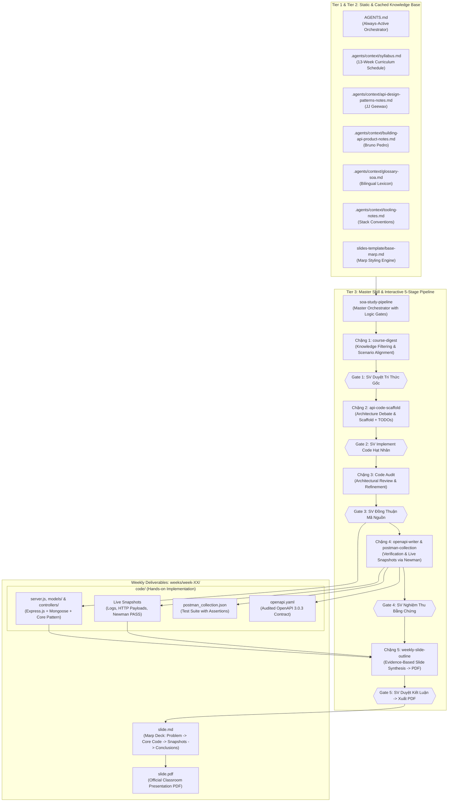

# ARCHITECTURE.md: SOA Course Material & Agent Pipeline Architecture

This document formalizes the system design, knowledge-caching architecture, and interactive execution pipeline powering the **Service-Oriented Architecture (SOA)** coursework learning and asset generation system.

---

## 1. System Architecture Overview

The system is designed around a **Human-in-the-Loop, Evidence-Driven Pedagogical Architecture**.
It places the **student's deep thinking and hands-on implementation** at the center, guided by the professor's lectures and authoritative textbooks, while leveraging LLMs for critical debate, boilerplate scaffolding, code auditing, automated verification snapshotting, and evidence-based slide synthesis.



---

## 2. Gemini Context Caching & Progressive Disclosure Model

To maximize reasoning precision while eliminating token bloat and context dilution, the system organizes information into three distinct tiers:

| Tier | Category | Files | Loading Strategy | Purpose |
| :--- | :--- | :--- | :--- | :--- |
| **Tier 1** | **Root Directives** | `AGENTS.md`, `ARCHITECTURE.md` | Auto-loaded at session root | Serves as the static system prompt prefix. Automatically cached by Gemini's prefix caching engine. |
| **Tier 2** | **Cached Knowledge Base** | `.agents/context/*.md`, `slides-template/*.md` | On-demand retrieval via `view_file` | Domain knowledge from JJ Geewax, Bruno Pedro, UET curriculum standards, and tooling guides. |
| **Tier 3** | **Active Production Runbooks** | `.agents/skills/*/SKILL.md` | Progressive disclosure | Loaded selectively when executing the corresponding pipeline step or master orchestrator. |

---

## 3. Weekly Deliverable Specification (`weeks/week-XX/`)

Each generated week is self-contained, reproducible, and strictly follows this directory structure:

```
weeks/week-XX/
├── slide.md                     # Marp presentation (Problem -> Architecture -> Core Code -> Snapshots -> Conclusions)
├── slide.pdf                    # Official presentation PDF generated via Marp CLI
└── code/                        # Self-contained Node.js microservice demo
    ├── package.json             # Minimal dependencies (express, mongoose, dotenv)
    ├── server.js                # Main HTTP server entrypoint & router
    ├── models/                  # Mongoose domain entity schemas
    ├── controllers/             # Business logic & student-implemented core pattern
    ├── openapi.yaml             # Single Source of Truth API Contract (OAS 3.0.3)
    ├── postman_collection.json  # Postman v2.1.0 collection with test assertions
    └── README.md                # Quickstart instructions for running service and tests
```

---

## 4. Technology Stack & Standard Conventions

- **Orchestration**: Custom Agent Skill Architecture with 5-stage human-in-the-loop checkpoints.
- **Service Layer**: Node.js (>= 18.x LTS), Express.js (v4.x).
- **Persistence Layer**: MongoDB with Mongoose ODM (v8.x). In-memory mock or local instance supported.
- **Contract Specification**: OpenAPI Specification v3.0.3 (YAML format).
- **Verification & Automation**: Postman Collection Schema v2.1.0 executed via Newman CLI.
- **Presentation Engine**: [Marp](https://marp.app/) Markdown format with responsive UET styling, exported via Marp CLI.
