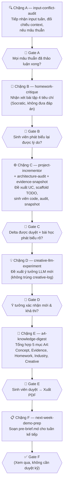

# Học Phần Kiến Trúc Hướng Dịch Vụ (SOA) — VNU-UET
### Weekly Summary Model v2.0

Kho lưu trữ vận hành theo triết lý **"Học thật để ứng dụng kiến thức vào thực tế"** trong mô hình **tổng kết sau mỗi buổi học** kết hợp **một dự án xuyên suốt (continuous project)**:

- **Người học (Sinh viên) làm trung tâm**: Tư duy kiến trúc sâu (Deep Thinking), tranh luận phản biện, và tự tay lập trình phần logic hạt nhân cho mỗi Use Case.
- **AI (LLM) đóng vai Co-pilot & Mentor**: Đối chiếu input với nguồn tri thức chuẩn, nhận xét bài tập theo chế độ Socratic, đề xuất delta code, lấy evidence snapshot, và soạn Knowledge Digest.
- **Nguồn chân lý định hướng**: Bài giảng trên lớp của thầy cô và tài liệu chuẩn ngành (*API Design Patterns* — JJ Geewax; *Building an API Product* — Bruno Pedro).

---

## 1. Bản Đồ Thư Mục

```
SOA/
├── AGENTS.md                         # Hướng dẫn Agent (luôn active)
├── ARCHITECTURE.md                   # Kiến trúc 2 tầng & luồng dữ liệu
├── README.md                         # File này
│
├── project/                          # ← DỰ ÁN XUYÊN SUỐT (cộng dồn 13 tuần)
│   ├── package.json
│   ├── server.js
│   ├── models/
│   ├── routes/
│   └── README.md
│
├── project-scope.md                  # Phạm vi dự án xuyên suốt (semi-static)
├── uc-backlog.md                     # Danh sách Use Case đã duyệt (semi-static)
├── creative-log.md                   # Lịch sử ý tưởng Creative LLM (semi-static)
│
├── .agents/
│   ├── context/                      # Tri thức nền tảng (Static / Cached)
│   │   ├── syllabus.md               # Khung chương trình 13 tuần
│   │   ├── api-design-patterns-notes.md
│   │   ├── building-api-product-notes.md
│   │   ├── glossary-soa.md
│   │   ├── tooling-notes.md
│   │   ├── industry-mapping.md       # Bảng ánh xạ SOA concept → LLM industry
│   │   └── a4-digest-template.md     # Mẫu trang A4 Knowledge Digest
│   └── skills/                       # 8 skill của pipeline
│       ├── input-conflict-audit/     # Chặng A
│       ├── homework-critique/        # Chặng B
│       ├── project-incrementor/      # Chặng C (đề xuất UC + scaffold)
│       ├── architecture-audit/       # Chặng C (review delta)
│       ├── evidence-snapshot/        # Chặng C (chạy test, chụp snapshot)
│       ├── creative-llm-experiment/  # Chặng D
│       ├── a4-knowledge-digest/      # Chặng E
│       └── next-week-demo-prep/      # Chặng F
│
└── weeks/
    └── week-XX/                      # Dữ liệu & output của từng tuần
        ├── practice/                 # [Input] Bài tập thực hành của sinh viên
        ├── input-log.md              # Chặng A — Input đã tiếp nhận & đối chiếu
        ├── homework-review.md        # Chặng B — Nhận xét bài tập
        ├── demo-delta.diff           # Chặng C — Delta code vào project/
        ├── creative-idea.md          # Chặng D — Ý tưởng LLM của tuần
        ├── digest-A4.md              # Chặng E — Knowledge Digest 1 trang A4
        └── pre-brief.md              # Chặng F — Bản nháp chuẩn bị tuần kế tiếp
```

---

## 2. Quy Trình 6 Chặng (A → F)

Mỗi tuần học thực hiện theo chu trình 6 chặng khép kín với **Logic Gates** — điểm dừng bắt buộc chờ sinh viên xác nhận trước khi sang chặng kế tiếp.



### Phân vai từng chặng

| Chặng | Skill | Sinh viên làm gì? | AI hỗ trợ gì? |
|:---|:---|:---|:---|
| **A** | `input-conflict-audit` | Cung cấp: slide/note lớp, bài tập, ghi chú giáo viên | Đối chiếu với syllabus/glossary/sách, nêu mâu thuẫn bằng câu hỏi thảo luận |
| **B** | `homework-critique` | Đặt bài làm vào `weeks/week-XX/practice/`; tự phân tích trước khi nghe nhận xét | Đọc code trong `practice/`, review 4 tiêu chí (pattern, status code, race condition, DX); đặt câu hỏi Socratic — không đưa đáp án |
| **C** | `project-incrementor` + `architecture-audit` + `evidence-snapshot` | Tranh luận về UC; **tự tay implement phần TODO**; xem xét feedback audit | Đề xuất UC nhỏ nhất từ 18 UC; scaffold boilerplate + TODO; review kiến trúc delta; chạy test lấy snapshot |
| **D** | `creative-llm-experiment` | Thảo luận ý tưởng, thử nghiệm nếu đơn giản | Đề xuất 1 ý tưởng LLM cụ thể, kiểm tra không trùng `creative-log.md` |
| **E** | `a4-knowledge-digest` | Đọc và duyệt nội dung A4; xác nhận xuất PDF | Tổng hợp 5 mục: Core concept, Evidence, Homework lesson, Industry application, Creative LLM idea |
| **F** | `next-week-demo-prep` | Xem qua bản nháp | Soạn `pre-brief.md` dựa trên syllabus + tài liệu đọc trước |

---

## 3. Dự Án Xuyên Suốt (`project/`)

- **Đề tài**: **App Quản Lý Bán Đồ Ăn Nhanh** (Fast Food Ordering & Management API).
- **Phạm vi**: 18 Use Cases phân bổ theo 4 nhóm nghiệp vụ (Tài khoản, Món ăn, Giỏ hàng, Đơn hàng) với luồng khép kín từ Đăng ký/Đăng nhập → Chọn món → Giỏ hàng → Đặt hàng → Quản lý trạng thái đơn.
- Codebase duy nhất tại `project/`, mỗi tuần chỉ thêm **một delta nhỏ** (1 endpoint, 1 middleware, 1 pattern) minh họa concept tuần đó — không dựng project mới.
- Mọi thay đổi vào `project/` phải là **đề xuất từ AI**, được sinh viên implement tại khối `TODO`, qua Gate C mới ghi thực sự vào repo.
- Xem đặc tả chi tiết tại [`project-scope.md`](file:///Users/hahoangloc/Working/UET/SOA/project-scope.md).
- Xem danh mục 18 Use Cases và trạng thái tại [`uc-backlog.md`](file:///Users/hahoangloc/Working/UET/SOA/uc-backlog.md).

---

## 4. Lịch Trình 13 Tuần

Chi tiết từng tuần xem tại [`.agents/context/syllabus.md`](file:///Users/hahoangloc/Working/UET/SOA/.agents/context/syllabus.md).

| Tuần | Chủ đề | Trọng tâm kiến trúc |
|:---|:---|:---|
| **01** | Giới thiệu API, Web Services | SOAP vs REST vs RPC; API-as-a-Product |
| **02** | REST & HTTP Fundamentals | 6 ràng buộc REST; HTTP Semantics & Status Codes |
| **03** | Nguyên tắc thiết kế API | 5 phương thức chuẩn; RFC 7807; DX Usability |
| **04** | OpenAPI & Swagger | Spec-First; OpenAPI 3.0.3 |
| **05** | Data Modeling & Resource Design | Phân cấp cha-con; Singleton; Association (N-N) |
| **06** | Authentication & Authorization | JWT; OAuth 2.0; RBAC |
| **07** | Backend Implementation | Ánh xạ Spec-to-Code; Express + Mongoose |
| **08** | API Testing | Postman/Newman; Happy & Negative Path |
| **09** | API Versioning | Semantic Versioning; Breaking changes; Sunset |
| **10** | Service Operation | Docker; Health Check; Observability; Rate Limiting |
| **11** | API Design Patterns | Idempotency Key; LRO; FieldMask; Pagination |
| **12** | API as a Product | Monetization; Developer Portal; SLA/SLO |
| **13** | Capstone | Design-First → Code → Auth → Test → CI/CD |

---

## 5. Yêu Cầu Kỹ Thuật

- **Node.js** ≥ 18.x LTS
- **MongoDB**: `mongodb://localhost:27017` hoặc Docker:
  ```bash
  docker run -d -p 27017:27017 --name mongo-soa mongo:latest
  ```
- **Newman CLI**: `npm install -g newman`
- **Marp CLI**: `npm install -g @marp-team/marp-cli`

---

## 6. Bắt Đầu Một Tuần Học

Gửi vào chat với nội dung đơn giản như:

> *"Bắt đầu tổng kết Tuần 3. Hôm nay thầy dạy về 5 phương thức chuẩn và RFC 7807. Bài tập về nhà là viết error response chuẩn cho 2 loại lỗi. [đính kèm slide/note]"*

AI sẽ khởi động từ **Chặng A** (`input-conflict-audit`) và dẫn dắt tuần tự qua Gate A → B → C → D → E → F.
