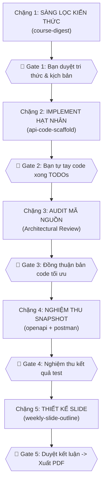

# Học Phần Kiến Trúc Hướng Dịch Vụ (SOA) - VNU-UET

Kho lưu trữ được thiết kế theo triết lý **"Học thật để ứng dụng kiến thức vào thực tế"**: 
- **Người học (Sinh viên) làm trung tâm**: Nắm giữ vai trò **Tư duy kiến trúc sâu (Deep Thinking)**, trực tiếp tranh luận phản biện và **tự tay lập trình phần logic hạt nhân** của từng tuần học để kiến thức không bị "trôi tuột".
- **AI (LLM) đóng vai trò Cộng sự & Trợ giảng (Co-pilot & Mentor)**: Giải phóng người học khỏi các thiết lập kỹ thuật rườm rà (DB config, Express boilerplate), đưa ra phản biện sắc bén (Critical Thinking), audit mã nguồn, chạy kiểm thử tự động lấy minh chứng thực nghiệm và hỗ trợ soạn thảo slide bài giảng chuẩn mực.
- **Nguồn chân lý định hướng**: Bài giảng trên lớp của thầy cô và các tài liệu chuẩn mực ngành (*API Design Patterns* - JJ Geewax, *Building an API Product* - Bruno Pedro).

---

## 1. Bản Đồ Đầu Vào & Đầu Ra (Inputs & Outputs Map)

Mọi tài nguyên bạn cần cung cấp hoặc tìm kiếm đều được phân bổ rõ ràng tại hai khu vực chính:

```
SOA/
├── .agents/context/              <=== [ĐẦU VÀO / INPUTS]: Nơi tra cứu tri thức nền tảng
│   ├── syllabus.md               # Khung chương trình 13 tuần học chuẩn UET
│   ├── api-design-patterns-notes.md  # Tổng hợp mẫu thiết kế API (JJ Geewax)
│   ├── building-api-product-notes.md # Tư duy sản phẩm & DX (Bruno Pedro)
│   ├── glossary-soa.md           # Từ điển thuật ngữ kiến trúc chuẩn Việt - Anh
│   └── tooling-notes.md          # Quy chuẩn công cụ (OpenAPI, Postman, Node/Mongo)
│
└── weeks/week-XX/                <=== [ĐẦU RA / OUTPUTS]: Sản phẩm hoàn thiện của từng tuần
    ├── slide.md                  # Bản thảo slide Marp (nội dung thực chất, minh chứng thực nghiệm)
    ├── slide.pdf                 # File PDF chính thức để thuyết trình hoặc nộp bài
    └── code/                     # Dự án mã nguồn microservice mẫu của tuần
        ├── package.json          # Danh sách thư viện tối giản
        ├── server.js             # Máy chủ Express & định tuyến
        ├── models/               # Schema Mongoose thể hiện tài nguyên dữ liệu
        ├── openapi.yaml          # Bản đặc tả hợp đồng dịch vụ chuẩn OpenAPI 3.0.3
        ├── postman_collection.json # Bộ test kịch bản Postman v2.1.0 (kèm script pm.test)
        └── README.md             # Hướng dẫn chạy nhanh service tại local
```

---

## 2. Quy Trình Học Tập 5 Chặng (Bạn & AI Phối Hợp Như Thế Nào?)

Mỗi tuần học (`week-01` đến `week-13`) được thực hiện theo chu trình 5 chặng khép kín có **Logic Gates (Điểm dừng phê duyệt)**:



### Chi tiết phân vai từng chặng:

| Chặng | Bạn (Người học) cần làm gì? | AI (LLM) hỗ trợ việc gì? | Điểm dừng phê duyệt (Logic Gate) |
| :--- | :--- | :--- | :--- |
| **Chặng 1: Sàng lọc** | Đưa ghi chú bài giảng trên lớp; chọn 1 kịch bản nghiệp vụ thực tế (hoặc đề xuất bài toán riêng). | Đọc tài liệu chuẩn, trích xuất vấn đề hệ thống, nguyên lý pattern, tư duy DX và gợi ý 2-3 kịch bản thực tế. | **Gate 1**: Bạn xác nhận tri thức gốc đã đúng trọng tâm và chốt kịch bản. |
| **Chặng 2: Implement** | Tranh luận kiến trúc cho tới khi thật sự hiểu; **mở code editor tự tay viết logic hạt nhân vào các khối `TODO`**. | Giải thích luồng dữ liệu; đặt câu hỏi phản biện; dựng sẵn khung boilerplate sạch sẽ (server, DB wiring, model, route stubs). | **Gate 2**: Bạn hoàn thành các khối `TODO` và báo cho AI. |
| **Chặng 3: Audit** | Đọc phản biện của AI; tiếp thu lý do tối ưu về mặt kiến trúc; thống nhất mã nguồn cuối cùng. | Đọc code gốc bạn vừa viết; review theo 4 tiêu chí (Pattern, mã lỗi REST, chống race condition, DX); đề xuất bản vá tối ưu. | **Gate 3**: Hai bên chốt mã nguồn đạt chuẩn kiến trúc sạch. |
| **Chặng 4: Nghiệm thu** | Quan sát kết quả test tự động; xác nhận các phản hồi API đúng như mong đợi thiết kế. | Soạn `openapi.yaml` (OAS 3.0.3); tạo `postman_collection.json`; chạy tự động test (Newman) và **chụp Snapshot logs, payload thực tế**. | **Gate 4**: Bạn nghiệm thu bộ bằng chứng thực nghiệm tin cậy. |
| **Chặng 5: Slide** | Đọc bản thảo `slide.md`; duyệt danh sách **Kết luận cốt lõi & Khuyến nghị (Core Takeaways)**; xuất file PDF. | Soạn slide Marp đúc kết từ Chặng 1, 3 và 4 (linh hoạt trang, bỏ slide rác, chèn snapshot thực tế); biên dịch ra `slide.pdf`. | **Gate 5**: Bạn duyệt nội dung -> Xuất bản phẩm PDF chính thức. |

---

## 3. Hướng Dẫn Bắt Đầu Nhanh (Quickstart Guide)

### Bước 1: Kích hoạt buổi học cùng AI
Khi bắt đầu một tuần học mới (ví dụ Tuần 2), bạn chỉ cần gửi yêu cầu vào khung chat:
> *"Bắt đầu học Tuần 2: Resource-Oriented Architecture & Standard Methods. Nội dung thầy trên lớp nhấn mạnh vào phương thức Update và List."*

Hệ thống sẽ kích hoạt Master Skill `soa-study-pipeline` và khởi động từ **Chặng 1**.

---

### Bước 2: Tự tay lập trình (Chặng 2)
Sau khi chốt kịch bản, AI sẽ tạo thư mục `weeks/week-XX/code/` với đầy đủ khung sườn. Bạn chỉ cần:
1. Mở tệp tin chứa pattern (ví dụ: `weeks/week-02/code/controllers/...` hoặc `middlewares/...`).
2. Tìm các khối chú thích đánh dấu:
   ```javascript
   // ============================================================================
   // TODO [HỌC VIÊN CÀI ĐẶT HẠT NHÂN]: Cài đặt logic xử lý tại đây...
   // ============================================================================
   ```
3. Tự tay viết mã nguồn xử lý thuật toán cốt lõi.

---

### Bước 3: Chạy thử và kiểm thử tại máy cục bộ

**1. Khởi động dịch vụ:**
```bash
cd weeks/week-XX/code
npm install
npm start
# Dịch vụ sẽ chạy tại http://localhost:3000
```

**2. Chạy kiểm thử tự động với Newman:**
Trong khi máy chủ đang chạy, mở một cửa sổ terminal mới và thực thi:
```bash
# Cài đặt newman nếu chưa có: npm install -g newman
newman run weeks/week-XX/code/postman_collection.json
```
Màn hình sẽ hiển thị kết quả kiểm thử xanh lá (`PASS`) cho từng kịch bản nghiệp vụ.

---

### Bước 4: Biên dịch Slide bài giảng sang PDF (Chặng 5)
Sau khi bạn duyệt bản thảo `slide.md` ở Chặng 5, bạn (hoặc AI) có thể xuất file PDF chất lượng cao thông qua lệnh:
```bash
npx @marp-team/marp-cli --no-stdin weeks/week-XX/slide.md --pdf --allow-local-files -o weeks/week-XX/slide.pdf
```

---

## 4. Lịch Trình Chuẩn 13 Tuần Học

Chi tiết mục tiêu, bài tập thực hành và tài liệu tham chiếu của từng tuần được quy định tại [`.agents/context/syllabus.md`](file:///Users/hahoangloc/Working/UET/SOA/.agents/context/syllabus.md):

| Tuần | Nội Dung Chính | Mục Tiêu Sinh Viên Đạt Được | Trọng Tâm Kiến Trúc & Công Cụ |
| :--- | :--- | :--- | :--- |
| **Tuần 01** | Giới thiệu API, Web Services | Hiểu vai trò API trong hệ thống phần mềm | Phân biệt SOAP vs REST vs RPC; Tư duy API-as-a-Product & Tháp nhu cầu DX |
| **Tuần 02** | REST & HTTP Fundamentals | Thiết kế request/response đúng chuẩn | 6 ràng buộc REST, Resource Naming (JJ Geewax Ch. 2), HTTP Semantics & Status Codes |
| **Tuần 03** | Nguyên tắc thiết kế API | Xây dựng API nhất quán, dễ dùng | 5 phương thức chuẩn (CRUD - JJ Geewax Ch. 3), Chuẩn hóa lỗi RFC 7807, DX Usability |
| **Tuần 04** | OpenAPI & Swagger | Tạo tài liệu API tự động | Phương pháp tiếp cận Spec-First / Design-First, OpenAPI Specification 3.0.3 & Swagger UI |
| **Tuần 05** | Data Modeling & Resource Design | Thiết kế cấu trúc dữ liệu cho API | Phân cấp tài nguyên cha-con, Singleton Sub-resources, Association Resources (N-N) |
| **Tuần 06** | Authentication & Authorization | Bảo mật API | Phân biệt AuthN vs AuthZ, Token mang quyền JWT, OAuth 2.0 & Phân quyền vai trò RBAC |
| **Tuần 07** | Backend Implementation | Xây dựng backend từ spec | Ánh xạ Spec-to-Code, kiến trúc nhiều tầng Express + Mongoose & Contract Validation |
| **Tuần 08** | API Testing | Kiểm thử tự động, hiệu năng | Kiểm thử tự động với Postman/Newman CLI (Happy & Negative Path), đo lường độ trễ |
| **Tuần 09** | API Versioning | Quản lý thay đổi API | Semantic Versioning, Breaking vs Non-breaking changes, Header Deprecation & Sunset |
| **Tuần 10** | Service Operation | Deploy, monitoring, bảo mật production | Đóng gói Docker Container, Health Check (`/healthz`), Observability (Logs, Metrics, Traces) & Rate Limiting |
| **Tuần 11** | API Design Patterns | Áp dụng mẫu thiết kế cho các tình huống thực tế | Advanced Patterns: Idempotency Key, Long-Running Operations (LRO), FieldMask, Token Pagination, Soft Delete |
| **Tuần 12** | API as a Product | Xem API là sản phẩm kinh doanh | Mô hình kinh doanh API (Monetization tiers), Developer Portal, TTFHW (< 5p) & Quản trị SLA/SLO |
| **Tuần 13** | Dự án nhóm (Capstone) | Triển khai API hoàn chỉnh + quản lý vòng đời | Tích hợp trọn vẹn Design-First, Code, Auth, Test, CI/CD, Docker & bảo vệ đồ án trước hội đồng |

---

## 5. Yêu Cầu Kỹ Thuật (Prerequisites)

- **Node.js**: Phiên bản LTS `>= 18.x` ([Tải tại nodejs.org](https://nodejs.org/)).
- **MongoDB**: Máy chủ MongoDB chạy tại local (`mongodb://localhost:27017`) hoặc container Docker:
  ```bash
  docker run -d -p 27017:27017 --name mongo-soa mongo:latest
  ```
- **Newman CLI**: `npm install -g newman` (phục vụ chạy test tự động dòng lệnh).
- **Marp CLI**: `npm install -g @marp-team/marp-cli` (phục vụ xuất slide PDF).
